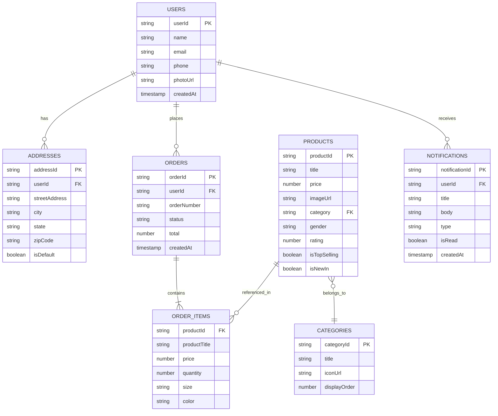

# E-Commerce Mobile Application - Database Design

## Overview

This document describes the database architecture and design for the E-Commerce Mobile Application. The application uses **Firebase Cloud Firestore** as the primary NoSQL database and **SQLite** for local data persistence.

## Database Architecture

### Cloud Database: Firebase Firestore

**Type**: NoSQL Document Database  
**Purpose**: Primary data storage for products, users, orders, and real-time synchronization

**Advantages**:
- Real-time data synchronization
- Offline support with automatic sync
- Scalable and managed infrastructure
- Built-in security rules
- Integration with Firebase ecosystem

### Local Database: SQLite

**Type**: Relational Database  
**Purpose**: Local data caching and offline functionality  
**Implementation**: `sqflite` package

---

## Firestore Database Schema

### Collections Overview

```
firestore/
├── users/
│   ├── {userId}/
│   │   ├── profile data
│   │   └── addresses/ (subcollection)
│   │       └── {addressId}/
├── products/
│   └── {productId}/
├── categories/
│   └── {categoryId}/
├── orders/
│   └── {orderId}/
└── notifications/
    └── {notificationId}/
```

---

## Collection Schemas

### 1. Users Collection

**Collection Path**: `/users/{userId}`

**Purpose**: Store user profile information and authentication data

**Schema**:

```typescript
{
  userId: string,              // Firebase Auth UID
  name: string,                // User's full name
  email: string,               // User's email address
  phone: string,               // Phone number
  photoUrl?: string,           // Profile photo URL (Firebase Storage)
  createdAt: Timestamp,        // Account creation date
  updatedAt: Timestamp,        // Last profile update
  isGuest: boolean,            // Guest mode flag
  preferences?: {
    gender: string,            // 'Men' | 'Women' | 'Kids'
    notifications: boolean,    // Push notification preference
  }
}
```

**Indexes**:
- `email` (for user lookup)
- `createdAt` (for analytics)

**Security Rules**:
```javascript
// Users can only read/write their own data
match /users/{userId} {
  allow read, write: if request.auth != null && request.auth.uid == userId;
}
```

---

### 2. Addresses Subcollection

**Collection Path**: `/users/{userId}/addresses/{addressId}`

**Purpose**: Store user shipping addresses

**Schema**:

```typescript
{
  addressId: string,           // Auto-generated ID
  streetAddress: string,       // Street address
  city: string,                // City name
  state: string,               // State/Province
  zipCode: string,             // Postal code
  country?: string,            // Country name
  isDefault: boolean,          // Default address flag
  createdAt: Timestamp,        // Creation date
  updatedAt: Timestamp         // Last update
}
```

**Indexes**:
- `isDefault` (for quick default address lookup)

---

### 3. Products Collection

**Collection Path**: `/products/{productId}`

**Purpose**: Store product catalog information

**Schema**:

```typescript
{
  productId: string,           // Auto-generated ID
  title: string,               // Product name
  description?: string,        // Product description
  price: number,               // Current price
  originalPrice?: number,      // Original price (for discounts)
  imageUrl: string,            // Primary product image URL
  images?: string[],           // Additional product images
  category: string,            // Category ID reference
  categoryName: string,        // Category name (denormalized)
  gender: string,              // 'Men' | 'Women' | 'Kids' | 'Unisex'
  rating: number,              // Average rating (0-5)
  reviewCount?: number,        // Number of reviews
  sizes?: string[],            // Available sizes ['S', 'M', 'L', 'XL', 'XXL']
  colors?: string[],           // Available colors
  stock?: number,              // Inventory count
  isTopSelling: boolean,       // Featured as top selling
  isNewIn: boolean,            // Featured as new arrival
  isActive: boolean,           // Product availability
  createdAt: Timestamp,        // Product creation date
  updatedAt: Timestamp         // Last update
}
```

**Indexes**:
- `category` (for category filtering)
- `gender` (for gender filtering)
- `isTopSelling` (for homepage queries)
- `isNewIn` (for homepage queries)
- `rating` (for sorting)
- `price` (for sorting and filtering)
- Composite: `category + gender` (for filtered searches)
- Composite: `isTopSelling + rating` (for top selling products)

**Security Rules**:
```javascript
// Products are read-only for clients
match /products/{productId} {
  allow read: if true;
  allow write: if false; // Only admin can write
}
```

---

### 4. Categories Collection

**Collection Path**: `/categories/{categoryId}`

**Purpose**: Store product categories

**Schema**:

```typescript
{
  categoryId: string,          // Auto-generated ID
  title: string,               // Category name
  iconUrl: string,             // Category icon URL
  description?: string,        // Category description
  displayOrder?: number,       // Sort order for display
  isActive: boolean,           // Category visibility
  productCount?: number,       // Number of products (denormalized)
  createdAt: Timestamp,        // Creation date
  updatedAt: Timestamp         // Last update
}
```

**Indexes**:
- `displayOrder` (for ordered display)
- `isActive` (for filtering active categories)

---

### 5. Orders Collection

**Collection Path**: `/orders/{orderId}`

**Purpose**: Store customer orders

**Schema**:

```typescript
{
  orderId: string,             // Auto-generated ID
  orderNumber: string,         // Human-readable order number
  userId: string,              // Reference to user
  userEmail: string,           // User email (denormalized)
  items: [                     // Order items
    {
      productId: string,       // Product reference
      productTitle: string,    // Product name (denormalized)
      productImage: string,    // Product image (denormalized)
      price: number,           // Price at time of purchase
      quantity: number,        // Quantity ordered
      size: string,            // Selected size
      color: string,           // Selected color
    }
  ],
  status: string,              // 'processing' | 'shipped' | 'delivered' | 'returned' | 'canceled'
  shippingAddress: {           // Shipping address snapshot
    streetAddress: string,
    city: string,
    state: string,
    zipCode: string,
    country: string
  },
  paymentMethod?: string,      // Payment method used
  subtotal: number,            // Items subtotal
  shippingCost: number,        // Shipping fee
  tax: number,                 // Tax amount
  total: number,               // Total amount
  createdAt: Timestamp,        // Order creation date
  updatedAt: Timestamp,        // Last status update
  deliveredAt?: Timestamp,     // Delivery date
  trackingNumber?: string      // Shipping tracking number
}
```

**Indexes**:
- `userId` (for user order history)
- `status` (for order filtering)
- `createdAt` (for sorting)
- Composite: `userId + status` (for filtered order history)
- Composite: `userId + createdAt` (for chronological order history)

**Security Rules**:
```javascript
// Users can only read their own orders
match /orders/{orderId} {
  allow read: if request.auth != null && 
              resource.data.userId == request.auth.uid;
  allow create: if request.auth != null && 
                request.resource.data.userId == request.auth.uid;
  allow update: if false; // Only admin can update
}
```

---

### 6. Notifications Collection

**Collection Path**: `/notifications/{notificationId}`

**Purpose**: Store user notifications

**Schema**:

```typescript
{
  notificationId: string,      // Auto-generated ID
  userId: string,              // Target user
  title: string,               // Notification title
  body: string,                // Notification message
  type: string,                // 'order' | 'promotion' | 'system'
  data?: object,               // Additional data payload
  isRead: boolean,             // Read status
  createdAt: Timestamp,        // Creation date
  expiresAt?: Timestamp        // Expiration date
}
```

**Indexes**:
- `userId` (for user notifications)
- `isRead` (for unread count)
- Composite: `userId + isRead + createdAt` (for notification feed)

---

## Local SQLite Database Schema

### Purpose
- Offline data caching
- Temporary data storage
- Customer information management

### Tables

#### customers Table

```sql
CREATE TABLE customers (
  id INTEGER PRIMARY KEY AUTOINCREMENT,
  name TEXT NOT NULL,
  email TEXT NOT NULL UNIQUE,
  phone TEXT NOT NULL,
  address TEXT,
  createdAt TEXT NOT NULL,
  CONSTRAINT email_format CHECK (email LIKE '%@%')
);
```

**Indexes**:
```sql
CREATE INDEX idx_customers_email ON customers(email);
CREATE INDEX idx_customers_createdAt ON customers(createdAt);
```

---

## Data Models (Dart Classes)

### Product Model

```dart
class Product {
  final String id;
  final String title;
  final double price;
  final double? originalPrice;
  final String imageUrl;
  final String category;
  final double rating;
  final bool isTopSelling;
  final bool isNewIn;
  final String gender;
  
  // Serialization methods
  factory Product.fromMap(Map<String, dynamic> data, String id);
  Map<String, dynamic> toMap();
}
```

### Category Model

```dart
class Category {
  final String id;
  final String title;
  final String iconUrl;
  
  factory Category.fromMap(Map<String, dynamic> data, String id);
  Map<String, dynamic> toMap();
}
```

### Address Model

```dart
class Address {
  final String id;
  final String streetAddress;
  final String city;
  final String state;
  final String zipCode;
  
  factory Address.fromMap(Map<String, dynamic> data, String id);
  Map<String, dynamic> toMap();
}
```

### Cart Item Model

```dart
class CartItem {
  final Product product;
  final String size;
  final String color;
  int quantity;
}
```

### Order Model

```dart
enum OrderStatus { processing, shipped, delivered, returned, canceled }

class OrderModel {
  final String id;
  final String orderNumber;
  final List<CartItem> items;
  final OrderStatus status;
  final DateTime date;
  final String shippingAddress;
  
  int get itemCount;
}
```

---

## Database Operations

### Common Queries

#### 1. Fetch Products by Category

```dart
FirebaseFirestore.instance
  .collection('products')
  .where('category', isEqualTo: categoryId)
  .where('isActive', isEqualTo: true)
  .get();
```

#### 2. Fetch Top Selling Products

```dart
FirebaseFirestore.instance
  .collection('products')
  .where('isTopSelling', isEqualTo: true)
  .orderBy('rating', descending: true)
  .limit(10)
  .get();
```

#### 3. Fetch User Orders

```dart
FirebaseFirestore.instance
  .collection('orders')
  .where('userId', isEqualTo: userId)
  .orderBy('createdAt', descending: true)
  .get();
```

#### 4. Search Products

```dart
FirebaseFirestore.instance
  .collection('products')
  .where('title', isGreaterThanOrEqualTo: searchTerm)
  .where('title', isLessThan: searchTerm + 'z')
  .get();
```

---

## Data Relationships

### Relationship Diagram



---

## Data Denormalization Strategy

To optimize read performance, certain data is intentionally denormalized:

1. **Category Name in Products**: Stored in product documents to avoid joins
2. **Product Details in Orders**: Snapshot of product data at purchase time
3. **User Email in Orders**: For quick order lookup and reporting
4. **Product Count in Categories**: For display without counting

**Trade-offs**:
- ✅ Faster read operations
- ✅ Reduced query complexity
- ❌ Requires update logic for consistency
- ❌ Increased storage usage

---

## Backup and Recovery

### Firestore Backup Strategy

1. **Automated Backups**: Firebase automatic daily backups
2. **Export Schedule**: Weekly exports to Cloud Storage
3. **Retention Policy**: 30-day backup retention
4. **Recovery Testing**: Monthly recovery drills

### SQLite Backup

1. **Local Backups**: Automatic on app update
2. **Cloud Sync**: User data synced to Firestore
3. **Migration Support**: Version-based schema migrations

---

## Performance Optimization

### Indexing Strategy

- All frequently queried fields are indexed
- Composite indexes for complex queries
- Regular index usage monitoring

### Query Optimization

- Limit query results with pagination
- Use `where` clauses to reduce data transfer
- Implement caching for frequently accessed data
- Lazy loading for large lists

### Data Caching

- Local SQLite cache for offline access
- In-memory cache for session data
- Firebase offline persistence enabled

---

## Security Considerations

### Firestore Security Rules

```javascript
rules_version = '2';
service cloud.firestore {
  match /databases/{database}/documents {
    // User data
    match /users/{userId} {
      allow read, write: if request.auth != null && request.auth.uid == userId;
      
      match /addresses/{addressId} {
        allow read, write: if request.auth != null && request.auth.uid == userId;
      }
    }
    
    // Products (read-only)
    match /products/{productId} {
      allow read: if true;
      allow write: if false;
    }
    
    // Categories (read-only)
    match /categories/{categoryId} {
      allow read: if true;
      allow write: if false;
    }
    
    // Orders
    match /orders/{orderId} {
      allow read: if request.auth != null && 
                  resource.data.userId == request.auth.uid;
      allow create: if request.auth != null && 
                    request.resource.data.userId == request.auth.uid;
      allow update, delete: if false;
    }
    
    // Notifications
    match /notifications/{notificationId} {
      allow read: if request.auth != null && 
                  resource.data.userId == request.auth.uid;
      allow write: if false;
    }
  }
}
```

### Data Validation

- Input validation on client side
- Server-side validation via Cloud Functions
- Type checking in security rules
- SQL injection prevention in SQLite queries

---

## Migration Strategy

### Schema Versioning

```dart
class DatabaseHelper {
  static const int _databaseVersion = 1;
  
  Future<void> _onUpgrade(Database db, int oldVersion, int newVersion) async {
    if (oldVersion < 2) {
      // Migration logic for version 2
    }
  }
}
```

### Firestore Migrations

- Cloud Functions for data migrations
- Gradual rollout with version flags
- Backward compatibility support
- Rollback procedures

---

## Monitoring and Analytics

### Database Metrics

- Query performance monitoring
- Read/write operation counts
- Storage usage tracking
- Error rate monitoring

### Tools

- Firebase Console Analytics
- Cloud Firestore Usage Dashboard
- Custom logging and metrics

---

## Conclusion

This database design provides a scalable, performant, and secure foundation for the E-Commerce Mobile Application. The combination of Firestore for cloud storage and SQLite for local persistence ensures a robust offline-first experience while maintaining data consistency and security.

---

**Document Version**: 1.0  
**Last Updated**: November 30, 2025  
**Database Version**: 1.0  
**GitHub Repository**: https://github.com/Moskaoud/Ecommerce
