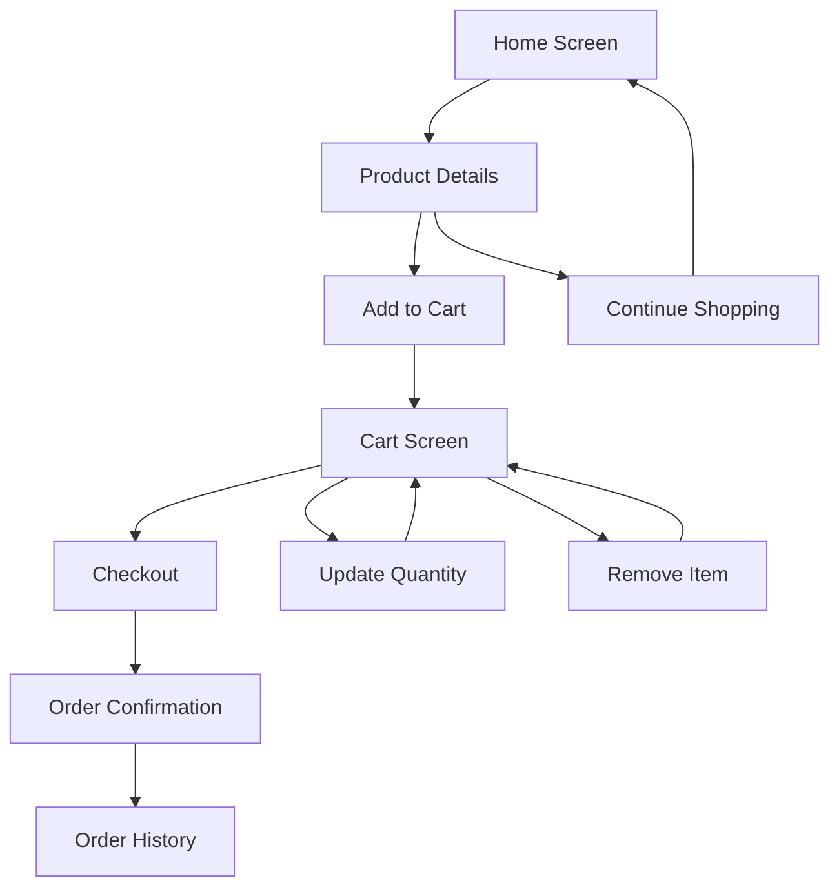
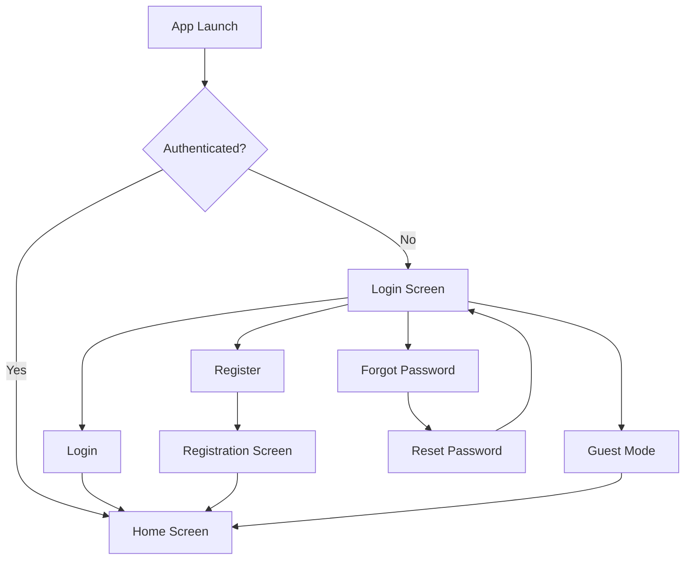

# E-Commerce Mobile Application - UI/UX Design Documentation

## Overview

This document outlines the user interface and user experience design for the E-Commerce Mobile Application. The design follows modern mobile UI/UX best practices with a focus on usability, accessibility, and visual appeal.

## Design Resources

### Figma Design System
**Primary Design File**: [E-Commerce Mobile App - Community](https://www.figma.com/design/I9kpeKQ5nRIVyMAwLwx6fS/Ecommerce-Mobile-App--Community-)

**Design Components**:
- Complete screen designs
- Component library
- Color palette
- Typography system
- Icon set
- Interaction patterns

---

## Design Principles

### 1. User-Centered Design
- **Intuitive Navigation**: Clear and predictable navigation patterns
- **Minimal Cognitive Load**: Simple, focused interfaces
- **Accessibility**: Readable fonts, sufficient contrast, touch-friendly targets

### 2. Visual Hierarchy
- **Clear Information Architecture**: Organized content structure
- **Consistent Layouts**: Predictable screen patterns
- **Visual Weight**: Important elements stand out

### 3. Feedback and Responsiveness
- **Immediate Feedback**: Visual confirmation of user actions
- **Loading States**: Progress indicators for async operations
- **Error Handling**: Clear, helpful error messages

### 4. Mobile-First
- **Touch-Optimized**: Minimum 44x44pt touch targets
- **Thumb-Friendly**: Important actions within easy reach
- **Responsive**: Adapts to different screen sizes

---

## Design System

### Color Palette

#### Primary Colors

```
Primary Purple:    #8E6CEF
Primary Dark:      #6B4FBF
Primary Light:     #A88FF2
```

#### Secondary Colors

```
Background:        #FFFFFF
Surface:           #F5F5F5
Card Background:   #FFFFFF
Divider:           #E0E0E0
```

#### Text Colors

```
Primary Text:      #1A1A1A
Secondary Text:    #757575
Disabled Text:     #BDBDBD
```

#### Semantic Colors

```
Success:           #4CAF50
Error:             #F44336
Warning:           #FF9800
Info:              #2196F3
```

#### Implementation

```dart
class AppColors {
  static const Color primary = Color(0xFF8E6CEF);
  static const Color primaryDark = Color(0xFF6B4FBF);
  static const Color primaryLight = Color(0xFFA88FF2);
  
  static const Color background = Color(0xFFFFFFFF);
  static const Color surface = Color(0xFFF5F5F5);
  
  static const Color textPrimary = Color(0xFF1A1A1A);
  static const Color textSecondary = Color(0xFF757575);
  
  static const Color success = Color(0xFF4CAF50);
  static const Color error = Color(0xFFF44336);
}
```

---

### Typography

#### Font Family
**Primary Font**: System Default (San Francisco on iOS, Roboto on Android)

#### Type Scale

```
Heading 1:    24px / Bold    / Letter Spacing: 0
Heading 2:    20px / Bold    / Letter Spacing: 0
Heading 3:    18px / SemiBold / Letter Spacing: 0
Body Large:   16px / Regular / Letter Spacing: 0.15
Body:         14px / Regular / Letter Spacing: 0.25
Caption:      12px / Regular / Letter Spacing: 0.4
Button:       14px / Medium  / Letter Spacing: 0.75 (uppercase)
```

#### Implementation

```dart
class AppTextStyles {
  static const TextStyle heading1 = TextStyle(
    fontSize: 24,
    fontWeight: FontWeight.bold,
  );
  
  static const TextStyle heading2 = TextStyle(
    fontSize: 20,
    fontWeight: FontWeight.bold,
  );
  
  static const TextStyle body = TextStyle(
    fontSize: 14,
    fontWeight: FontWeight.normal,
    letterSpacing: 0.25,
  );
  
  static const TextStyle caption = TextStyle(
    fontSize: 12,
    fontWeight: FontWeight.normal,
    letterSpacing: 0.4,
  );
}
```

---

### Spacing System

**Base Unit**: 8px

```
XXS:  4px   (0.5 × base)
XS:   8px   (1 × base)
S:    12px  (1.5 × base)
M:    16px  (2 × base)
L:    24px  (3 × base)
XL:   32px  (4 × base)
XXL:  48px  (6 × base)
```

#### Implementation

```dart
class AppSpacing {
  static const double xxs = 4.0;
  static const double xs = 8.0;
  static const double s = 12.0;
  static const double m = 16.0;
  static const double l = 24.0;
  static const double xl = 32.0;
  static const double xxl = 48.0;
}
```

---

### Border Radius

```
Small:   4px   (buttons, chips)
Medium:  8px   (cards, inputs)
Large:   12px  (modals, sheets)
XLarge:  16px  (images, containers)
Round:   999px (circular elements)
```

---

### Elevation & Shadows

```
Level 1:  0px 1px 3px rgba(0,0,0,0.12)   (Cards)
Level 2:  0px 2px 6px rgba(0,0,0,0.16)   (Raised buttons)
Level 3:  0px 4px 12px rgba(0,0,0,0.20)  (Modals, dialogs)
Level 4:  0px 8px 24px rgba(0,0,0,0.24)  (Navigation bar)
```

---

## Screen Designs

### 1. Authentication Screens

#### Login Screen
**Purpose**: User authentication entry point

**Key Elements**:
- Email input field
- Password input field with visibility toggle
- "Forgot Password?" link
- Login button (primary)
- "Or continue with" divider
- Google Sign-In button
- "Don't have an account? Sign Up" link
- "Continue as Guest" option

**User Flow**:
```
Login Screen → [Valid Credentials] → Home Screen
            → [Forgot Password] → Password Reset Screen
            → [Sign Up] → Registration Screen
            → [Guest Mode] → Home Screen (limited features)
```

---

#### Registration Screen
**Purpose**: New user account creation

**Key Elements**:
- Name input field
- Email input field
- Phone number input with country code picker
- Password input field with strength indicator
- Confirm password field
- Terms & Conditions checkbox
- Sign Up button (primary)
- "Already have an account? Login" link

**Validation**:
- Email format validation
- Password strength requirements (min 6 characters)
- Password confirmation match
- Required field indicators

---

#### Forgot Password Screen
**Purpose**: Password recovery

**Key Elements**:
- Email input field
- Instructions text
- Send Reset Link button
- Back to Login link

---

### 2. Home Screen

**Purpose**: Main landing page with product discovery

**Layout Structure**:
```
┌─────────────────────────────┐
│ App Bar                     │
│  - Gender Selector          │
│  - Search Icon              │
│  - Cart Icon (with badge)   │
├─────────────────────────────┤
│ Search Bar                  │
├─────────────────────────────┤
│ Categories (Horizontal)     │
│  [Icon] [Icon] [Icon] ...   │
├─────────────────────────────┤
│ Top Selling Section         │
│  - Section Header           │
│  - Product Grid (2 columns) │
├─────────────────────────────┤
│ New In Section              │
│  - Section Header           │
│  - Product Grid (2 columns) │
└─────────────────────────────┘
```

**Key Elements**:
- **Gender Selector**: Segmented control (Men/Women/Kids)
- **Search Bar**: Tap to navigate to search page
- **Categories**: Horizontal scrollable list with icons
- **Product Cards**: Image, title, price, rating
- **Bottom Navigation**: Home, Categories, Orders, Profile

**Interactions**:
- Tap category → Navigate to category products
- Tap product card → Navigate to product details
- Tap search bar → Navigate to search page
- Tap cart icon → Navigate to cart

---

### 3. Search & Filter Screen

**Purpose**: Product search and filtering

**Key Elements**:
- Search input field with auto-focus
- Filter button (opens filter sheet)
- Sort dropdown (Recommended, Newest, Price)
- Product grid results
- Empty state with "Explore Categories" CTA

**Filter Options**:
- Category selection
- Gender selection (Men/Women/Kids)
- Price range (min/max sliders)

**Filter Sheet Design**:
```
┌─────────────────────────────┐
│ Filters                  [X]│
├─────────────────────────────┤
│ Category                    │
│  ○ All Categories           │
│  ○ Hoodies                  │
│  ○ Shorts                   │
│  ...                        │
├─────────────────────────────┤
│ Gender                      │
│  ○ All                      │
│  ○ Men                      │
│  ○ Women                    │
│  ○ Kids                     │
├─────────────────────────────┤
│ Price Range                 │
│  Min: [___] Max: [___]      │
│  [========○========]        │
├─────────────────────────────┤
│ [Reset]    [Apply Filters]  │
└─────────────────────────────┘
```

---

### 4. Product Details Screen

**Purpose**: Detailed product information and purchase options

**Layout**:
```
┌─────────────────────────────┐
│ [<] Product Image      [♡]  │
│                             │
│ ┌─────┬─────┬─────┐         │
│ │ Img │ Img │ Img │         │
│ └─────┴─────┴─────┘         │
├─────────────────────────────┤
│ Product Title               │
│ ★★★★☆ 4.5 (120 reviews)    │
│ $49.99  $79.99             │
├─────────────────────────────┤
│ Size                        │
│ [S] [M] [L] [XL] [XXL]     │
├─────────────────────────────┤
│ Color                       │
│ ● ● ● ● ●                  │
├─────────────────────────────┤
│ Quantity                    │
│ [-] 1 [+]                   │
├─────────────────────────────┤
│ Description                 │
│ Lorem ipsum...              │
├─────────────────────────────┤
│ [Add to Bag - $49.99]       │
└─────────────────────────────┘
```

**Key Elements**:
- Product image carousel
- Favorite button (heart icon)
- Size selector (chip buttons)
- Color selector (color dots)
- Quantity stepper
- Price display with original price strikethrough
- Add to Bag button (sticky at bottom)

**Interactions**:
- Swipe images for gallery view
- Tap size to select
- Tap color to select
- +/- buttons for quantity
- Add to Bag → Navigate to cart

---

### 5. Shopping Cart Screen

**Purpose**: Review and manage cart items

**Layout**:
```
┌─────────────────────────────┐
│ My Cart              [Clear]│
├─────────────────────────────┤
│ ┌─────┬─────────────┬─────┐ │
│ │ Img │ Product     │ [-] │ │
│ │     │ Size: M     │  1  │ │
│ │     │ Color: Blue │ [+] │ │
│ │     │ $49.99      │     │ │
│ └─────┴─────────────┴─────┘ │
│ ┌─────┬─────────────┬─────┐ │
│ │ Img │ Product     │ [-] │ │
│ │     │ ...         │  2  │ │
│ └─────┴─────────────┴─────┘ │
├─────────────────────────────┤
│ Price Summary               │
│ Subtotal:          $99.98   │
│ Shipping:          $5.00    │
│ Tax:               $8.40    │
│ ─────────────────────────   │
│ Total:            $113.38   │
├─────────────────────────────┤
│ [Checkout - $113.38]        │
└─────────────────────────────┘
```

**Key Elements**:
- Cart item cards with image, details, quantity controls
- Remove All button
- Price summary breakdown
- Checkout button (sticky)
- Empty state with "Explore Categories" CTA

**Interactions**:
- +/- buttons adjust quantity
- Quantity 0 removes item
- Clear button removes all items
- Checkout → Navigate to checkout

---

### 6. Checkout Screen

**Purpose**: Order finalization

**Layout**:
```
┌─────────────────────────────┐
│ Checkout              [<]   │
├─────────────────────────────┤
│ Shipping Address       [>]  │
│ John Doe                    │
│ 123 Main St, City, ST       │
├─────────────────────────────┤
│ Payment Method         [>]  │
│ **** **** **** 1234         │
├─────────────────────────────┤
│ Order Summary               │
│ 3 items                     │
│ Subtotal:          $99.98   │
│ Shipping:          $5.00    │
│ Tax:               $8.40    │
│ ─────────────────────────   │
│ Total:            $113.38   │
├─────────────────────────────┤
│ [Place Order - $113.38]     │
└─────────────────────────────┘
```

**Success Modal**:
```
┌─────────────────────────────┐
│         ✓                   │
│   Order Placed!             │
│                             │
│ Your order #12345 has been  │
│ successfully placed.        │
│                             │
│ [Track Order] [Continue]    │
└─────────────────────────────┘
```

---

### 7. Profile Screen

**Purpose**: User account management

**Layout**:
```
┌─────────────────────────────┐
│ Profile               [Edit]│
├─────────────────────────────┤
│      ┌─────────┐            │
│      │  Photo  │            │
│      └─────────┘            │
│      John Doe               │
│      john@email.com         │
├─────────────────────────────┤
│ [Address]              [>]  │
│ [Wishlist]             [>]  │
│ [Payment]              [>]  │
│ [Settings]             [>]  │
├─────────────────────────────┤
│ [Logout]                    │
└─────────────────────────────┘
```

**Edit Profile**:
- Profile photo upload
- Name editing
- Email display (read-only)
- Phone number editing
- Save button

**Address Management**:
- List of saved addresses
- Add new address button
- Edit/Delete address options
- Set default address

---

### 8. Orders Screen

**Purpose**: Order history and tracking

**Layout**:
```
┌─────────────────────────────┐
│ Orders                      │
├─────────────────────────────┤
│ [Delivered][Processing][...]│
├─────────────────────────────┤
│ Order #12345                │
│ 3 items • $113.38           │
│ Nov 28, 2025                │
│ Status: Delivered           │
│ ─────────────────────────   │
│ Order #12344                │
│ 1 item • $49.99             │
│ Nov 25, 2025                │
│ Status: Processing          │
└─────────────────────────────┘
```

**Tabs**:
- Delivered
- Processing
- Cancelled

**Empty State**:
- Illustration
- "No orders yet" message
- "Explore Categories" button

---

## Component Library

### Buttons

#### Primary Button
```dart
ElevatedButton(
  style: ElevatedButton.styleFrom(
    backgroundColor: AppColors.primary,
    foregroundColor: Colors.white,
    minimumSize: Size(double.infinity, 48),
    shape: RoundedRectangleBorder(
      borderRadius: BorderRadius.circular(8),
    ),
  ),
  onPressed: onPressed,
  child: Text('Button Text'),
)
```

#### Secondary Button
```dart
OutlinedButton(
  style: OutlinedButton.styleFrom(
    foregroundColor: AppColors.primary,
    side: BorderSide(color: AppColors.primary),
    minimumSize: Size(double.infinity, 48),
  ),
  onPressed: onPressed,
  child: Text('Button Text'),
)
```

---

### Product Card

**Design**:
```
┌─────────────┐
│             │
│   Product   │
│    Image    │
│             │
├─────────────┤
│ Product Name│
│ $49.99      │
│ ★★★★☆ 4.5  │
└─────────────┘
```

**Implementation**: See `lib/widgets/product_card.dart`

---

### Input Fields

**Text Input**:
```dart
TextField(
  decoration: InputDecoration(
    labelText: 'Label',
    hintText: 'Hint text',
    border: OutlineInputBorder(
      borderRadius: BorderRadius.circular(8),
    ),
    prefixIcon: Icon(Icons.email),
  ),
)
```

---

### Bottom Navigation

**Design**:
```
┌─────┬─────┬─────┬─────┐
│ 🏠  │ 📂  │ 📋  │ 👤  │
│Home │Cats │Order│Prof │
└─────┴─────┴─────┴─────┘
```

**Icons**:
- Home: `Icons.home`
- Categories: `Icons.grid_view`
- Orders: `Icons.receipt_long`
- Profile: `Icons.person`

---

## Interaction Patterns

### Navigation Transitions
- **Forward Navigation**: Slide from right
- **Back Navigation**: Slide to right
- **Modal Presentation**: Slide from bottom

### Loading States
- **Full Screen**: Circular progress indicator centered
- **List Loading**: Shimmer effect placeholders
- **Button Loading**: Spinner inside button

### Empty States
- Illustration or icon
- Descriptive message
- Call-to-action button

### Error States
- Error icon
- Error message
- Retry button or alternative action

---

## Accessibility

### Touch Targets
- Minimum size: 44x44 points
- Adequate spacing between interactive elements

### Color Contrast
- Text contrast ratio: Minimum 4.5:1
- Interactive elements: Minimum 3:1

### Screen Reader Support
- Semantic labels for all interactive elements
- Meaningful content descriptions
- Logical focus order

### Keyboard Navigation
- Tab order follows visual hierarchy
- Focus indicators visible
- All actions keyboard accessible

---

## Responsive Design

### Breakpoints
```
Small:   < 360dp
Medium:  360dp - 600dp
Large:   > 600dp
Tablet:  > 768dp
```

### Adaptive Layouts
- Product grid: 2 columns (mobile), 3-4 columns (tablet)
- Navigation: Bottom bar (mobile), Side drawer (tablet)
- Spacing: Scales with screen size

---

## Animation & Motion

### Micro-interactions
- Button press: Scale down to 0.95
- Card tap: Subtle elevation change
- Toggle: Smooth transition

### Page Transitions
- Duration: 300ms
- Easing: Cubic bezier (0.4, 0.0, 0.2, 1)

### Loading Animations
- Circular progress: Indeterminate rotation
- Shimmer: Left-to-right gradient sweep

---

## Design Tokens

### Implementation Reference

```dart
// lib/utils/theme/app_theme.dart
class AppTheme {
  static ThemeData lightTheme = ThemeData(
    primaryColor: AppColors.primary,
    scaffoldBackgroundColor: AppColors.background,
    appBarTheme: AppBarTheme(
      backgroundColor: Colors.white,
      elevation: 0,
      iconTheme: IconThemeData(color: AppColors.textPrimary),
      titleTextStyle: AppTextStyles.heading2,
    ),
    elevatedButtonTheme: ElevatedButtonThemeData(
      style: ElevatedButton.styleFrom(
        backgroundColor: AppColors.primary,
        minimumSize: Size(double.infinity, 48),
      ),
    ),
  );
}
```

---

## User Flows

### Purchase Flow



### Authentication Flow



---

## Design Guidelines

### Do's ✅
- Use consistent spacing from the spacing system
- Follow the established color palette
- Maintain minimum touch target sizes
- Provide visual feedback for all interactions
- Use clear, concise copy
- Implement proper loading and error states

### Don'ts ❌
- Don't use arbitrary spacing values
- Don't introduce new colors without updating the palette
- Don't create tiny touch targets
- Don't leave users without feedback
- Don't use jargon or unclear language
- Don't show blank screens during loading

---

## Future Enhancements

### Planned Design Updates
- 🔄 Dark mode theme
- 🔄 Advanced product filtering UI
- 🔄 Wishlist grid view
- 🔄 Product review and rating interface
- 🔄 Order tracking timeline
- 🔄 Promotional banners and badges
- 🔄 Animated onboarding screens

---

## Conclusion

This UI/UX design system provides a comprehensive foundation for building a consistent, accessible, and delightful e-commerce mobile experience. All designs are available in the Figma file for detailed specifications and developer handoff.

---

**Document Version**: 1.0  
**Last Updated**: November 30, 2025  
**Design System Version**: 1.0  
**Figma Design**: https://www.figma.com/design/I9kpeKQ5nRIVyMAwLwx6fS/Ecommerce-Mobile-App--Community-  
**GitHub Repository**: https://github.com/Moskaoud/Ecommerce
